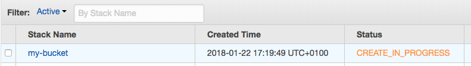
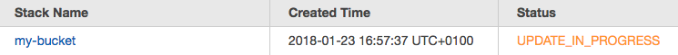
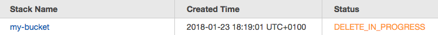

# cloudformation-operator

A Kubernetes operator for managing CloudFormation stacks via `kubectl` and a custom resource definition.

**Warning: this project is in alpha state. It should only be used to try out the demo and get the general idea.**

# Setup

You need full API access to a cluster running at least Kubernetes v1.7.

For simplicity, start the CloudFormation operator locally. This would run as a Pod in your cluster later.

```console
$ go run main.go --interval=10s --region=eu-central-1
```

Modify the region flag to match yours and make sure you have permission to create and delete CloudFormation stacks.

The operator should print some output but shouldn't actually do anything at this point. Leave in running and continue the following steps in a separate terminal window.

# Demo

Create a new custom resource called `Stack` by submitting `manifests/crd-cloudformation-stack.yaml` to your cluster.

```console
$ kubectl apply -f manifests/crd-cloudformation-stack.yaml
customresourcedefinition "stacks.cloudformation.linki.space" created
```

This will add another resource to your cluster that feels much like a native Kubernetes resource.

```console
$ kubectl get stacks
No resources found.
```

Currently you don't have any stacks. Let's create a simple one that manages an S3 bucket:

```yaml
apiVersion: cloudformation.linki.space/v1alpha1
kind: Stack
metadata:
  name: my-bucket
spec:
  template: |
    ---
    AWSTemplateFormatVersion: '2010-09-09'

    Resources:
      S3Bucket:
        Type: AWS::S3::Bucket
        Properties:
          VersioningConfiguration:
            Status: Suspended
```

The Stack resource's definition looks a lot like any other Kubernetes resource manifest.
The `spec` section describes an attribute called `template` which contains a regular CloudFormation template.

Go ahead and submit the stack definition to your cluster:

```console
$ kubectl apply -f manifests/cfs-my-bucket-v1.yaml
stack "my-bucket" created
$ kubectl get stacks
NAME        AGE
my-bucket   21s
```

Open your AWS CloudFormation console and find your new stack.



Once the CloudFormation stack is created check that your S3 bucket was created as well.

The operator will write back additional information about the CloudFormation Stack to your Kubernetes resource's `status` section, e.g. the `stackID`:

```console
$ kubectl get stacks my-bucket -o yaml
spec:
  template:
  ...
status:
  stackID: arn:aws:cloudformation:eu-central-1:123456789012:stack/my-bucket/327b7d3c-f27b-4b94-8d17-92a1d9da85ab
```

Voilà, you just created a CloudFormation stack by only talking to Kubernetes.

You can also update your stack: Let's change the `VersioningConfiguration` from `Suspended` to `Enabled`:

```yaml
apiVersion: cloudformation.linki.space/v1alpha1
kind: Stack
metadata:
  name: my-bucket
spec:
  template: |
    ---
    AWSTemplateFormatVersion: '2010-09-09'

    Resources:
      S3Bucket:
        Type: AWS::S3::Bucket
        Properties:
          VersioningConfiguration:
            Status: Enabled
```

As with most Kubernetes resources you can update your `Stack` resource by applying a changed manifest to your Kubernetes cluster or by using `kubectl edit stack my-stack`.

```console
$ kubectl apply -f manifests/cfs-my-bucket-v2.yaml
stack "my-bucket" configured
```

Wait until the operator discovered and executed the change, then look at your AWS CloudFormation console again and find your stack being updated, yay.



However, often you'll want to extract dynamic values out of your CloudFormation stack template into so called `Parameters` so that your template itself doesn't change that often and, well, is really a *template*.

Let's extract the `VersioningConfiguration` into a parameter:

```yaml
apiVersion: cloudformation.linki.space/v1alpha1
kind: Stack
metadata:
  name: my-bucket
spec:
  parameters:
    VersioningConfiguration: Enabled
  template: |
    ---
    AWSTemplateFormatVersion: '2010-09-09'

    Parameters:
      VersioningConfiguration:
        Type: String

    Resources:
      S3Bucket:
        Type: AWS::S3::Bucket
        Properties:
          VersioningConfiguration:
            Status:
              Ref: VersioningConfiguration
```

and apply it to your cluster:

```console
$ kubectl apply -f manifests/cfs-my-bucket-v3.yaml
stack "my-bucket" configured
```

Since we changed the template a little this will update your CloudFormation stack. However, since we didn't actually change anything because we injected the same `VersioningConfiguration` value as before, your S3 bucket shouldn't change.

As you can any CloudFormation parameters defined in the CloudFormation template can be specified in the `Stack` resource's `spec.parameters` section. It's a simple key/value map.

Furthermore, CloudFormation supports so called `Outputs`. These can be used for dynamic values that are only known after a stack has been created.
In our example, we don't define a particular S3 bucket name but instead let AWS generate one for us.

Let's change our CloudFormation template to expose the generated bucket name via an `Output`:

```yaml
apiVersion: cloudformation.linki.space/v1alpha1
kind: Stack
metadata:
  name: my-bucket
spec:
  parameters:
    VersioningConfiguration: Enabled
  template: |
    ---
    AWSTemplateFormatVersion: '2010-09-09'

    Parameters:
      VersioningConfiguration:
        Type: String

    Resources:
      S3Bucket:
        Type: AWS::S3::Bucket
        Properties:
          VersioningConfiguration:
            Status:
              Ref: VersioningConfiguration

    Outputs:
      BucketName:
        Value: !Ref 'S3Bucket'
```

Apply the change to our cluster and wait until the operator has successfully updated the CloudFormation stack.

```console
$ kubectl apply -f manifests/cfs-my-bucket-v4.yaml
stack "my-bucket" configured
```

Every `Output` you define will be available in your Kubernetes resource's `status` section under the `outputs` field as a key/value map.

Let's check the name of our S3 bucket:

```console
$ kubectl get stacks my-bucket -o yaml
spec:
  template:
  ...
status:
  stackID: ...
  outputs:
    BucketName: my-bucket-s3bucket-tarusnslfnsj
```

In the template we defined an `Output` called `BucketName` that should contain the name of our bucket after stack creation. Looking up the corresponding value under `.status.outputs[BucketName]` reveals that our bucket was named `my-bucket-s3bucket-tarusnslfnsj`.

The operator captures the whole lifecycle of a CloudFormation stack. So if you delete the resource from Kubernetes, the operator will teardown the CloudFormation stack as well. Let's do that now:

```console
$ kubectl delete stack my-bucket
stack "my-bucket" deleted
```

Check your CloudFormation console once more and validate that your stack as well as your S3 bucket were deleted.


